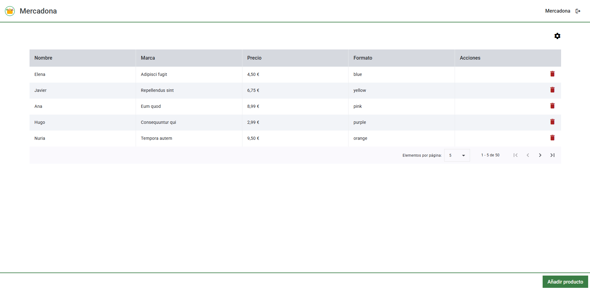

# Prueba Tecnica Mercadona

## Índice

- [Prueba Tecnica Mercadona](#prueba-tecnica-mercadona)
  - [Índice](#índice)
  - [Pantalla de inicio](#pantalla-de-inicio)
  - [Pantalla de tornillos](#pantalla-de-tornillos)
  - [Tecnologías utilizadas](#tecnologías-utilizadas)
  - [Instalación](#instalación)
  - [Servidor de desarrollo](#servidor-de-desarrollo)
  - [Tests](#tests)
  - [Autor](#autor)

---

Este proyecto es una prueba técnica para Mercadona. Consiste en una aplicación web en la que se pueden revisar tornillos, añadir nuevos tornillos y eliminar tornillos existentes.

## Pantalla de inicio

Dónde nos encontramos una tarjeta que nos indica la sección "Tornillos", a la que podremos acceder, cuantos tornillos hay por revisar, y un botón con el texto "Revisar" que nos permitirá acceder a la pantalla de revisión de tornillos.


Este **botón de revisar** tendrá en cuenta si estamos registrados o no en la aplicación. Si no estamos registrados, nos abrirá un modal en el cual deberemos introducir nuestro **nombre de usuario**. Al hacerlo, se cambiará el botón de la cabecera situado en la parte superior derecha de la pantalla, por un botón de "Cerrar sesión", en el que aparecerá el nombre de usuario establecido, y se nos rediregirá a la pantalla de **tornillos**.

También se puede iniciar sesión de la misma manera haciendo click directamente en el botón de **iniciar sesión** de la cabecera. El proceso será el mismo, se abrirá un modal en el que deberemos introducir nuestro nombre de usuario.


Si tenemos la **sesión iniciada**, podremos acceder a la pantalla de tornillos directamente haciendo click en el **botón de revisar**.

Si no tenemos la sesión iniciada, no podremos acceder a la pantalla de tornillos, ya que hay implementado un **guard** que nos redirigirá a la pantalla de inicio.

Siguiendo con la cabecera, si hacemos **click** en el **logo** y/o en el texto de Mercadona, nos **redirigirá** a la pantalla de **inicio**.

Para finalizar con la cabecera, al hacer click en el botón de **"Cerrar sesión"**, se cerrará la sesión y se nos **redirigirá a la pantalla de inicio**.

## Pantalla de tornillos

En esta pantalla nos encontramos con una lista de tornillos, en la que podremos ver el **nombre** , el **precio**, el **formato** y el **modelo** de los tornillos a revisar.



La tabla con la que nos encontramos cuenta con **paginación**, que, junto a la **cabecera** de la tabla, **siempre aparecerá** en pantalla, y será el **contenido** de la tabla por lo que hagamos **scroll** si la lista de tornillos es muy larga y no cabe en la pantalla.

Esta paginación puede indicar cuantos elementos queremos mostrar por página, con las opciones 5, 10 y 20, y también nos permite movernos por las páginas de la tabla.

La **última columna** de la tabla es la columna de acciones, donde se encuentra un icono de **papelera**, que al hacer click en él, nos abrirá un modal de confirmación para **eliminar el tornillo** seleccionado.


Si nos fijamos encima de la tabla, nos encontraremos un **icono de engranaje**, que al hacer click en él, nos abrirá un modal en el que podremos **ordenar** las columnas de la tabla de tornillos, **fijarlas** o desfijarlas, y también podremos seleccionar las columnas que queremos **ver**. Si una columna está fijada, no la podremos mover de su posición, y todo cambio que se produzca en la tabla, no afectará a la columna fijada.


Si salimos del modal, y volvemos a la página de tornillos, veremos que abajo a la derecha de la tabla, aparece un botón de **Añadir producto**, que al hacer click en él, nos abrirá un modal en el que podremos añadir un nuevo producto.


En este modal nos encontraremos un formulario para añadir un producto, en el que deberemos introducir el **nombre**, el **precio**, el **formato** y la **marca** del producto. Si no introducimos todos los campos, no podremos añadir el producto.

El nombre es un campo libre de texto, al igual que la marca. El precio es un campo numérico, aunque también se puede aumentar y reducir en **0.1** utilizando los botones de los lados. Formato, por su parte, es un selector, que muestra como opcines los formatos ya exiastentes en la "base de datos".

Si hemos rellenado todos los productos y hacemos click en guardar, veremos como el producto aparece en la tabla de tornillos.

## Tecnologías utilizadas

Para la realización de este proyecto, se ha utilizado **Angular**, en su versión **19.1.7**. Además, se ha utilizado la librería **Angular Material** para agregar estilos y componentes a la aplicación.

No se ha utilizado una base de datos en la aplicación, ya que la prueba es solamente de front, pero se ha implementado el uso del **LocalStorage**, para que aunque se recargue la página, los datos no se pierdan.

## Instalación

Para instalar el proyecto, se debe clonar el repositorio y ejecutar el comando `npm install` para instalar las dependencias necesarias.

## Servidor de desarrollo

Para iniciar un servidor de desarrollo local, ejecuta:

```bash
npm start
```

Se abrirá directamente una pestaña en tu navegador con la aplicación. Si no se abre, navega a `http://localhost:4200/`. La aplicación se recargará automáticamente cada vez que modifiques algún archivo fuente.

## Tests

Para ejecutar los tests unitarios, utiliza el siguiente comando:

```bash
ng test
```

## Autor

- [Héctor González Viejo](https://www.linkedin.com/in/hector-gonzalez-viejo-/)
